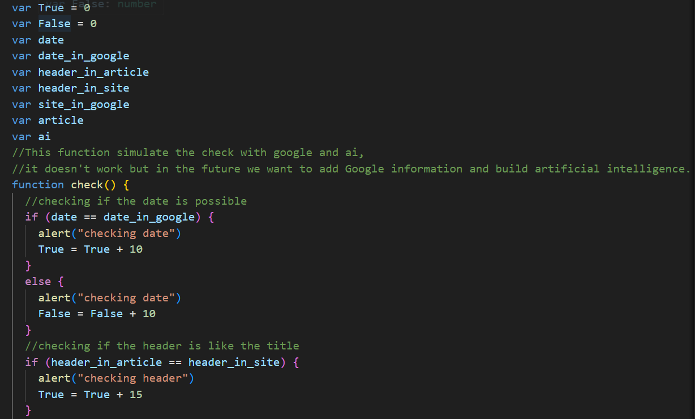
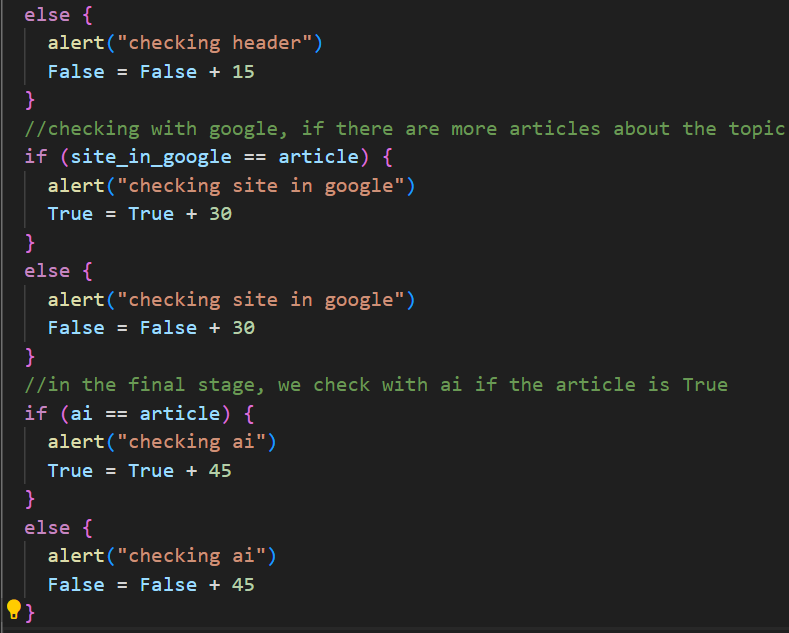

# AI-check

In our project, you can select an article and check with the help of artificial intelligence (we simulate it, see a code section that simulates it below) how correct or incorrect the article is, we use data from Google and Chat GPT to try to simulate artificial intelligence in the best way.  
*The project was created for the Coolest Projects competition.

<strong>link to the project:</strong>
 https://ai-check-site.netlify.app/
  
The function that simulates artificial intelligence and google: 
   

 

Credits for the project: 

 The font in the gallery page from:
https://www.dafont.com/another-danger.font?back=theme
 
 The animation from:
https://giphy.com/explore/loading
 
 Artical 1 is from:
https://www.dafont.com/another-danger.font?back=theme
 
 Artical 2 is from:
https://www.psypost.org/
 
 Artical 3 is from:
https://www.theverge.com/
 
 Artical 4 is from:
https://www.seattletimes.com/
 
 Artical 5 is from:
https://www.nba.com/
 
 Artical 6 is from:
https://edition.cnn.com/
 
 Artical 7 is from:
https://www.space.com/
 
 Artical 8 is from:
https://www.ndtv.com/
 
 Artical 9 is from:
https://www.nytimes.com/international/
